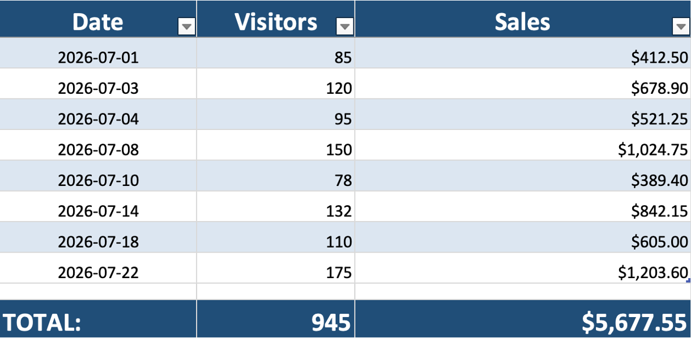
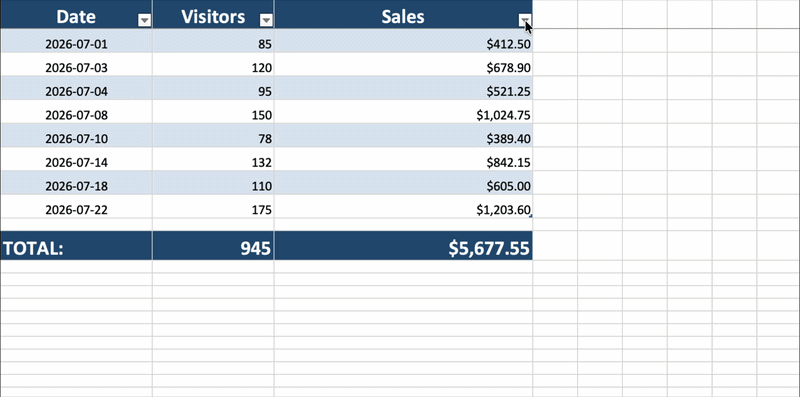
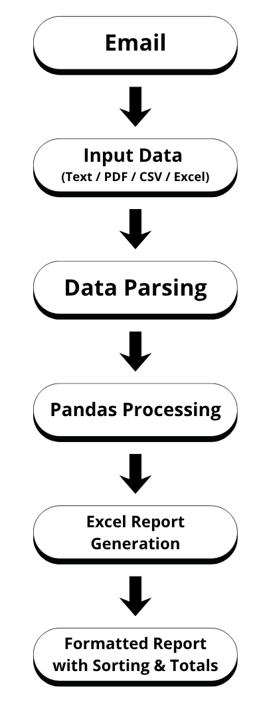
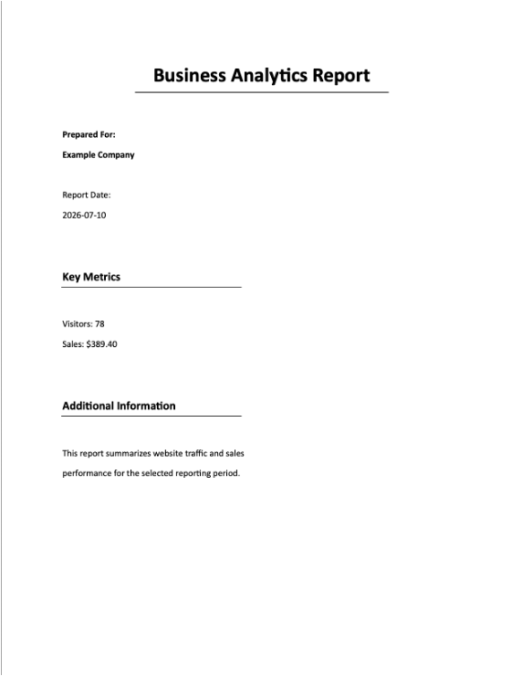

# Email Report Automation System

## Overview

Email Report Automation System is a Python application that automatically extracts business metrics from emails and generates a formatted Excel report.

The program connects to a Gmail inbox, retrieves reports from a specified sender, extracts data from email content and supported attachments, and updates a centralized Excel spreadsheet. The generated report includes automatic totals, filtering, sorting, and professional formatting.

### Generated Report



### Sorting Demo



## Features

* Connects to Gmail using IMAP
* Processes reports from a specified sender
* Extracts data from plain text emails
* Supports PDF attachments
* Supports CSV attachments
* Supports Excel attachments (.xlsx and .xls)
* Prevents duplicate entries
* Automatically calculates totals
* Generates a formatted Excel report
* Includes Excel filtering and sorting
* Uses environment variables for secure credential storage
* Logs errors for easier debugging

## Workflow

The application follows the process below:



## Technologies Used

* Python
* pandas
* openpyxl
* pypdf
* imaplib
* python-dotenv
* logging

## Installation

1. Clone the repository.

2. Install dependencies:

```bash
pip install -r requirements.txt
```

3. Create a `.env` file using the `.env.example` template.

4. Add your Gmail credentials and sender information.

## Configuration

Create a `.env` file in the project root directory:

```env
EMAIL=your_email@gmail.com
APP_PASSWORD=your_gmail_app_password
EMAIL_SENDER=sender_email@gmail.com
```

### Variable Descriptions

| Variable     | Description                                   |
| ------------ | --------------------------------------------- |
| EMAIL        | Gmail account used to access the inbox        |
| APP_PASSWORD | Gmail App Password                            |
| EMAIL_SENDER | Email address that sends reports              |

## Usage

Run the application:

```bash
python main.py
```

The program will:

1. Connect to Gmail.
2. Search for reports from the configured sender.
3. Extract metrics from email content and attachments.
4. Update the Excel report.
5. Recalculate totals.
6. Apply formatting and table styling.

The generated report will be saved as `report.xlsx`.

## Expected Input Formats

### Plain Text Email

```text
Date: 2026-07-24
Visitors: 70
Sales: $576.12
```

### CSV Attachment

```csv
Date,Visitors,Sales
2026-07-24,70,576.12
```

### Excel Attachment

| Date       | Visitors |  Sales |
| ---------- | -------: | -----: |
| 2026-07-24 |       70 | 576.12 |

### PDF Attachment

```text
Date: 2026-07-24
Visitors: 70
Sales: $576.12
```



## Input Flexibility

The parser accepts several common formatting variations:

- Sales values with or without a dollar sign
- Extra whitespace between labels and values
- Metrics provided in any order
- Multiple date formats, including:
  - 2026-07-24
  - 2026/07/24
  - 07/24/2026
  - 07-24-26

## Project Structure

```text
email-automation/
├── examples/
│   ├── sample_report.csv
│   ├── sample_report.pdf
│   └── sample_report.xlsx
├── screenshots/
│   ├── pdf-example.png
│   ├── report-preview.png
│   ├── sorting-demo.gif
│   └── workflow-diagram.png
├── .env.example
├── .gitignore
├── main.py
├── README.md
└── requirements.txt
```

## Author

Veronika Kortunova

